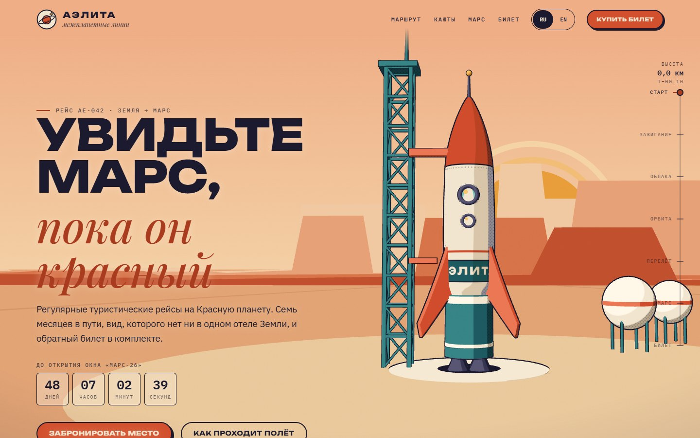
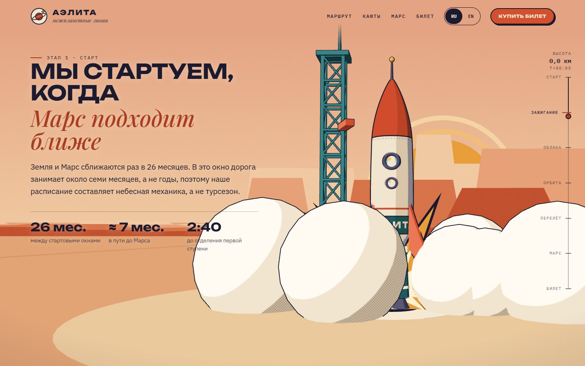
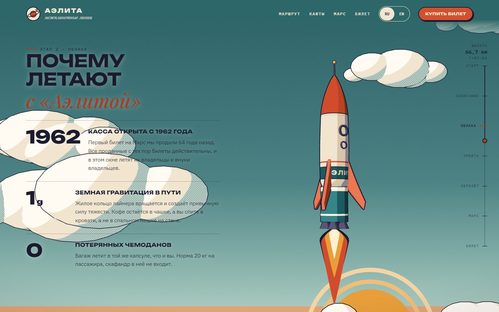
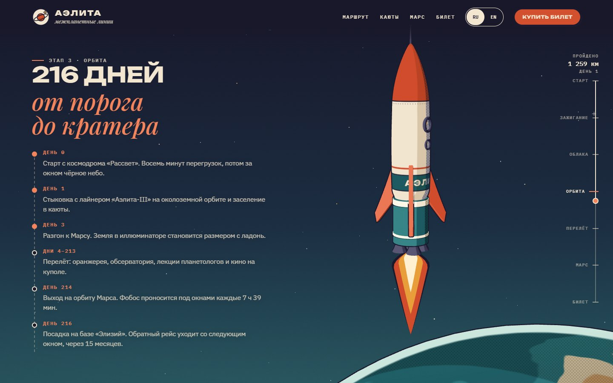
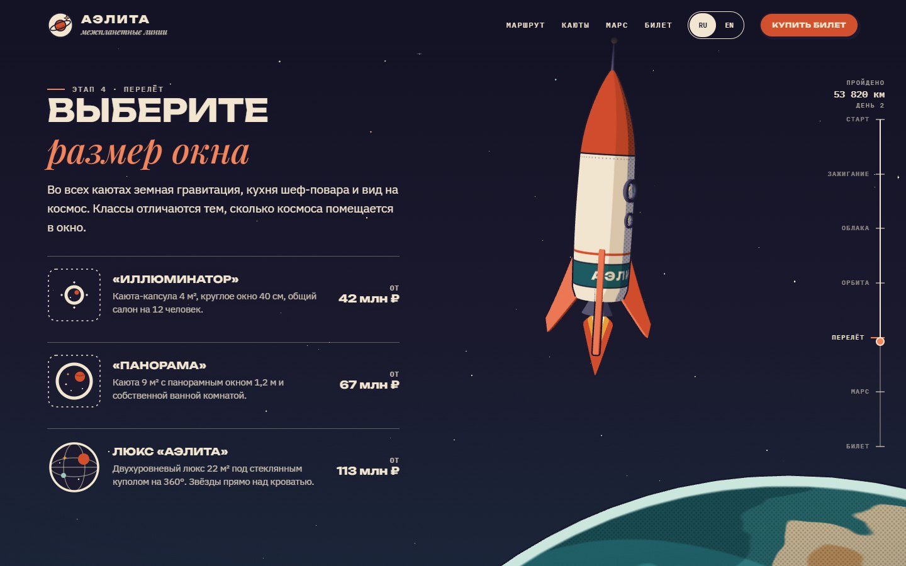
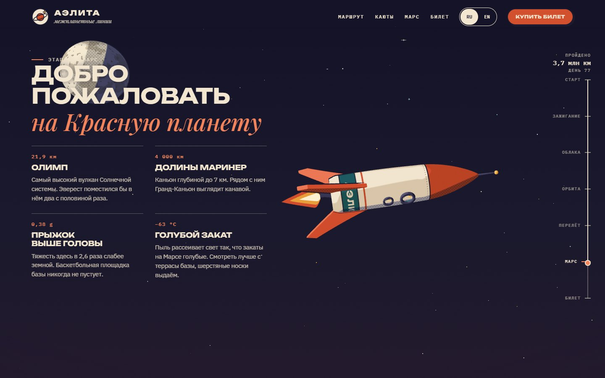
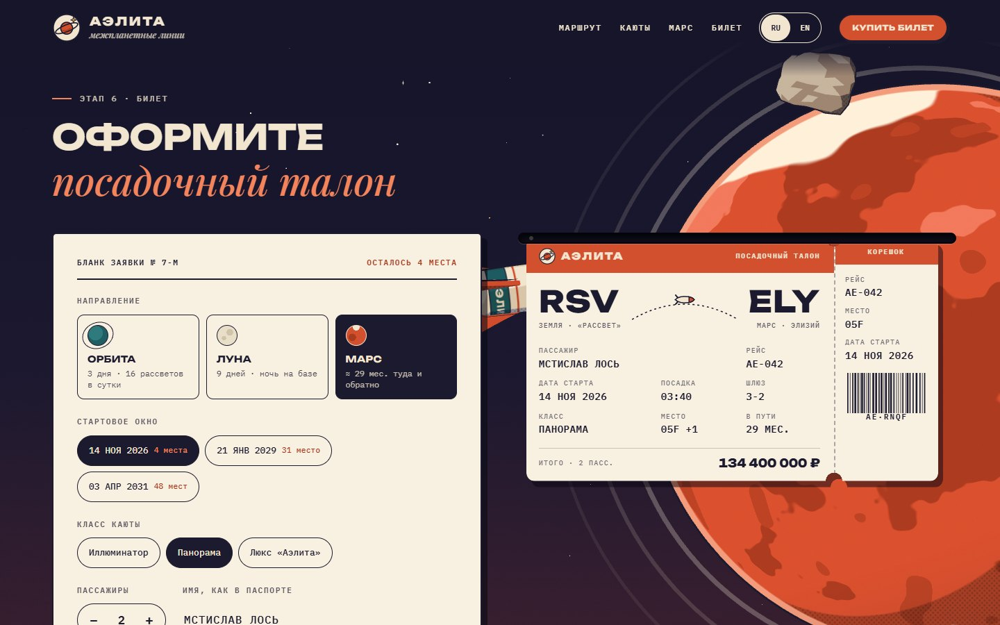
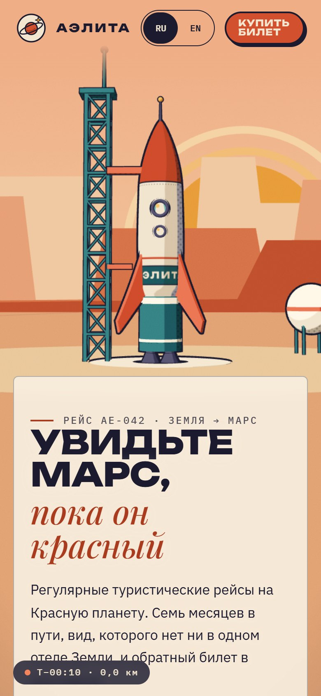

<p align="center">
  
</p>

# «Аэлита» — межпланетные линии

> Концепт-лендинг вымышленной турфирмы, которая с 1962 года продаёт рейсы на орбиту, Луну и Марс, — в эстетике советского космического плаката. Прокрутка ведёт ракету от стартового стола на рассвете через облака и отделение ступени к Земле, Луне и Марсу, а бронирование в финале печатает посадочный талон.


**Главное:**

- **Плакат, который двигается.** Без постобработки и почти без текстур: собственный toon-шейдер с тремя плоскими тонами, полутоновым растром в тенях и контурами методом inverted hull постоянной толщины в пикселях.
- **Весь сайт — один полёт.** Прокрутка переводится в «сюжетное время» от 0 до 7, и по нему ключами анимируются камера, ракета, ступени, дым, небо, Земля, Луна, Марс и боковой альтиметр. При прокрутке назад всё отматывается обратно.
- **Бронь как предмет.** Форма собирает посадочный талон, в котором место, шлюз, код брони и штрихкод выводятся из хэша введённых данных. Поля перещёлкиваются как табло split-flap, талон «печатается» из щели, а сверху ложится штамп.

## Идея

«Аэлита» — вымышленный перевозчик, который продаёт билеты на Марс с 1962 года, как будто межпланетный туризм наступил сразу вслед за первыми полётами в космос. Название и пассажир по умолчанию, инженер Мстислав Лось, отсылают к роману Алексея Толстого о полёте на Марс. Бренд говорит с серьёзной интонацией и мягкой иронией: все проданные с 1962 года билеты действительны, багаж сверх нормы летит следующим окном через 26 месяцев, на террасе базы выдают шерстяные носки, а возврат после отделения первой ступени не производится.

Визуальный язык — советский космический плакат: ограниченная палитра, литографская печать, толстый контур, полутоновый растр, плоские слои гор и солнце из концентрических колец. Задача была перенести эту эстетику в живое 3D так, чтобы сцена выглядела как отпечаток, а не как рендер, и при этом оставалась читаемой подложкой под текст.

Лендинг устроен как повествование из семи глав: старт, зажигание, облака, орбита, перелёт, Марс и билет. Каждая глава, кроме финального бронирования, — закреплённая текстовая панель, которую сцена сопровождает. Проект демонстрирует стилизованный рендеринг в WebGL, сторителлинг на прокрутке и проработанные микровзаимодействия; как референс он подходит туристическим и тревел-брендам, музеям и ретро-проектам.

## Скриншоты

<table>
  <tr>
    <td width="50%" valign="top"><br><sub>Зажигание: дым у стартового стола</sub></td>
    <td width="50%" valign="top"><br><sub>Сквозь облака</sub></td>
  </tr>
  <tr>
    <td width="50%" valign="top"><br><sub>Орбита и маршрут на 216 дней</sub></td>
    <td width="50%" valign="top"><br><sub>Каюты трёх классов</sub></td>
  </tr>
  <tr>
    <td width="50%" valign="top"><br><sub>Добро пожаловать на Марс</sub></td>
    <td width="50%" valign="top"><br><sub>Бронирование и посадочный талон</sub></td>
  </tr>
</table>

<p align="center">
  
  <br><sub>Мобильная версия</sub>
</p>

## Возможности

### Предстартовая проверка

- Лоадер оформлен как чек-лист: «Обшивка корпуса», «Заправка баков — 100%», «Прогрев двигателей», «Экипаж на борту». Он ждёт шрифты и сцену, но не дольше 4,5 секунды, а затем уезжает вверх.

### Старт

- Заголовок «Увидьте Марс, пока он красный» и обратный отсчёт до ближайшего стартового окна к Марсу: даты 2026, 2029, 2031 и 2033 годов, дальше с шагом 780 суток — синодическим периодом Марса. Подпись меняется сама: «До открытия окна „Марс-26“».
- В 3D — стартовый стол на рассвете: ферма обслуживания с мигающим маячком, топливные сферы, слои столовых гор и плакатное солнце.

### Полёт по прокрутке

- **Зажигание.** Отводится стрела фермы, вспыхивает «комиксная» звезда пламени, у стола расходится облако дыма, камера дрожит, и ракета уходит вверх, оставляя шлейф.
- **Облака.** Ракета проходит сквозь облака и медленно поворачивается вокруг своей оси, небо из персикового становится бирюзовым, а затем ночным.
- **Орбита.** Проступают звёзды и Земля, свет становится «космическим», первая ступень отделяется с кольцом дыма и уходит вниз, вторая включает двигатель, и ракета ложится на курс.
- **Перелёт.** Мимо проходит Луна, Земля уменьшается, впереди появляется Марс.
- **Марс.** Марс с тонким ореолом атмосферы, мимо проносится Фобос, двигатель выключается.
- Рядом с каждой главой — закреплённая панель: факты о стартовом окне, три причины летать с «Аэлитой», маршрут на 216 дней (пункты загораются по ходу полёта), три класса кают с ценами и четыре достопримечательности Марса.

### Альтиметр

- Боковая шкала с семью этапами полёта: по клику страница плавно переходит к главе, текущий этап отмечен.
- Показания меняются с прокруткой: сначала «T−00:10» и отсчёт до отрыва от стола, затем «T+» с минутами и секундами и высота в километрах, после выхода в космос — «ДЕНЬ N» и пройденный путь до 225 млн км.
- На экранах до 900 px шкалу заменяет компактная плашка внизу с таймером и расстоянием.

### Бронирование и посадочный талон

- «Бланк заявки № 7-М»: направление (Орбита, Луна, Марс), одно из трёх ближайших стартовых окон со счётчиком оставшихся мест, класс каюты, от одного до шести пассажиров и имя.
- Итоговая цена считается сразу: базовая цена направления × коэффициент класса (1; 1,6; 2,7) × число пассажиров.
- Талон рядом с формой заполняется вживую: при каждом изменении поля перещёлкиваются, как буквы на вокзальном табло.
- По кнопке «Забронировать и напечатать» талон втягивается в щель принтера, лампочка на щели загорается зелёным, талон рывками выезжает обратно, на него падает круглый штамп «Оформлено», а корешок отрывается. Ниже появляется подтверждение с кодом брони.
- Пустое имя не проходит проверку: поле получает `aria-invalid`, подсказку и фокус. Кнопка «Оформить ещё один билет» очищает имя для следующего пассажира.
- Деньги не списываются и данные никуда не отправляются: бронь демонстрационная.

### Язык и валюта

- Переключатель RU / EN меняет все тексты, подписи для скринридеров, заголовок вкладки, месяцы, склонения, валюту и цены (₽ или $), алфавит для анимации табло и даже надпись на корпусе ракеты. Выбор запоминается в `localStorage`.

## Как это устроено

### Сюжетное время и режиссура

`computeT()` превращает положение прокрутки в число от 0 до 7: целая часть — номер главы, дробная — прогресс внутри неё. Координаты глав измеряются заново при изменении размеров. Значение сглаживается экспоненциально, и на нём построено всё остальное: небо, альтиметр, пункты маршрута и 3D-сцена. Движение задано дорожками ключей вида `[t, x, y, z]` — `CAM_POS`, `CAM_LOOK`, `EARTH_K`, `MARS_K` — с интерполяцией `easeInOut`, а короткие события описаны окнами `seg(t, a, b)`: отвод стрелы, зажигание, отделение ступени, разворот ракеты, включение и выключение двигателей.

Ракета при этом почти не двигается: вниз уезжает весь стартовый мир — на `altAt(t) = 300 · s^2,3 + 90 · max(0, t − 3)`, где `s = seg(t, 1.05, 3.0)`, — и после выхода в космос скрывается. Так ракета и камера всё время остаются рядом с началом координат. Дым тоже не симулируется, а вычисляется из `t`: у каждой из 120 частиц (64 на телефоне) есть время рождения, и её положение и размер — функция возраста. Поэтому полёт полностью обратим. `setViewOffset` сдвигает изображение вправо от текстовой колонки на десктопе и вверх на телефоне.

### Toon-шейдер и полутон

`FS_POSTER` делит освещённость `N·L` на три плоских тона — тень, полутон и свет — с порогами около 0 и 0,5; ширина перехода берётся из `fwidth`, поэтому границы чёткие, но без лесенки. Каждый материал — это три цвета: у облаков, например, тень зеленовато-серая, а у металла и стекла растр выключен. В зоне собственной тени поверх ложится полутоновый растр, который строится в экранных координатах, как типографская сетка, повёрнутая на 45°:

```glsl
float halftone(vec2 fc, float cell, float cover){
  vec2 q = mat2(.7071,-.7071,.7071,.7071) * (fc / (cell * uPR));
  float d = length(fract(q) - .5);
  float r = sqrt(cover) * .5;
  float aa = .8 / (cell * uPR);
  return 1. - smoothstep(r - aa, r + aa, d);
}
```

Размер ячейки умножается на плотность пикселей, поэтому точки одинаковые на обычном экране и на Retina. Планеты используют `FS_PLANET`: цвета поверхности — океаны, материки, облака и шапки Земли, низменности, каньон и полярная шапка Марса, тёмные моря Луны — генерируются value-noise прямо в шейдере, а затем проходят через ту же трёхтоновую схему с синеватой тенью, растром и цветной каймой по краю диска.

### Контуры inverted hull

Почти каждый объект создаётся функцией `mk()` вместе с копией, которая рисуется задними гранями тёмным цветом `#1B1A2E`. Вершинный шейдер `OVS` сдвигает её вершины в пространстве отсечения вдоль экранной проекции нормали на `uThick` пикселей, умноженных на `clip.w` и делённых на разрешение, поэтому контур одинаковой толщины вблизи и вдали. У цилиндров и коробок нормали на рёбрах разорваны, и контур лопнул бы по швам, поэтому `addOutlineNormals()` сваривает вершины с одинаковыми координатами и записывает усреднённую нормаль в отдельный атрибут `onormal`. Для облаков и дыма контур — такой же `InstancedMesh`, разделяющий с основным мешем матрицы экземпляров.

### Ракета и мир из примитивов

- Корпус — `LatheGeometry` по профилю `shipR(y)`: цилиндр с лёгким утолщением и нос по степенному косинусу. Три стабилизатора выдавлены из кривых через `ExtrudeGeometry`, иллюминаторы собраны из тора, стекла и блика, у первой ступени четыре сопла.
- Раскраска корпуса — canvas-текстура 1024 × 1024: красный нос, чёрная полоса с заклёпками, бирюзовый пояс с надписью «АЭЛИТА» шрифтом Unbounded и вертикальный номер «AE-042». Текстура перерисовывается, когда загрузятся шрифты, и при смене языка.
- Пламя — плоские силуэты из четырёх цветных слоёв, которые поворачиваются к камере и подрагивают, их длина следует за тягой двигателя.
- Ферма обслуживания — стойки, перекладины и раскосы, слитые функцией `mergeGeos()` в один меш с одним контуром. Горы — четыре слоя процедурных силуэтов, которые светлеют к горизонту; слева, за текстом, они специально ниже и спокойнее.
- Облака — 26 групп по 5–7 сфер в одном `InstancedMesh`. В космосе — 1 500 звёзд, из них 5% крупные четырёхлучевые. Фобос — икосаэдр, деформированный синусами.

### Небо и контраст текста

Небо — не WebGL, а CSS-градиент из трёх цветов, которые берутся из таблицы `SKY` с десятью ключами — от персикового рассвета через бирюзу к ночному индиго со сливовым отсветом у горизонта в главе о Марсе — и пишутся в CSS-переменные. Поверх неба сцена рендерится с прозрачным фоном. Чтобы текст всегда читался, шапка, альтиметр и каждая панель берут цвет неба на своей высоте, считают относительную яркость по формуле WCAG и переключают `data-tone` между светлой и тёмной схемой. Пороги разнесены (0,17 и 0,2), чтобы тон не мигал на границе.

### Посадочный талон

- **Детерминированность.** Строка «направление | окно | класс | пассажиры | имя» хэшируется FNV-1a и служит зерном для генератора mulberry32. Из него выводятся место (у каждого класса свой формат: люкс — L1–L4, «Панорама» — только места A и F), шлюз, код брони `AE·XXXX` из алфавита без похожих символов и штрихкод. Одинаковые данные всегда дают одинаковый талон.
- **Штрихкод** — декоративный SVG из полос случайной ширины от того же зерна.
- **Табло** — функция `flap()`: каждый символ несколько раз перебирает случайные буквы из алфавита текущего языка и останавливается на нужной, с задержкой по позиции, так что строка проявляется слева направо.
- **Печать** — CSS: анимация `steps(16)` даёт рывки термопринтера, штамп прилетает с перелётом по `cubic-bezier` и ложится через `mix-blend-mode: multiply`, вырубка по краям талона и корешка сделана масками из радиальных градиентов.

## Дизайн

| Токен | Цвет | Роль |
| --- | --- | --- |
| `--cream` / `--paper` | `#F2E6D0` / `#F8F0E1` | светлый текст на тёмном, бумага формы и талона |
| `--terra` | `#D2502D` | главный акцент: кнопки, нос ракеты, Марс, штамп |
| `--terra-deep` / `--terra-glow` | `#A93B1F` / `#F4845C` | акцент на светлом и на тёмном фоне |
| `--teal` / `--teal-pale` | `#1F5E63` / `#9CC6BD` | первая ступень, ферма, пояс ракеты, океаны Земли; бледный вариант — в звёздах и небе |
| `--night` | `#1B1A2E` | текст, контуры, фон страницы и подвала |
| `--mustard` | `#E9A23B` | маячки, солнце, фокус |

- **Типографика.** Unbounded — логотип, заголовки в верхнем регистре, цены и коды на талоне, слово «АЭЛИТА» в подвале высотой до 270 px. Playfair Display курсивом — вторая строка заголовков и подзаголовок бренда. IBM Plex Sans — основной текст. IBM Plex Mono — метки, альтиметр, цифры отсчёта, поля формы и талона.
- **Композиция.** Слева закреплённые текстовые панели, справа сцена. Кнопки-таблетки с жёсткой смещённой тенью, которая «вдавливается» при нажатии, пунктирные разделители и корешки — отсылка к печатной продукции. Поверх всего анимированное зерно в режиме `overlay` и лёгкая виньетка.
- **Мобильная версия.** До 1180 px прячется меню. До 900 px панели перестают быть закреплёнными и становятся карточками с размытием фона, альтиметр превращается в плашку, камера отъезжает дальше, дыма и звёзд меньше, плотность пикселей не выше 1,5. До 560 px талон перестраивается вертикально, корешок уходит под основную часть, варианты направления идут в одну колонку.
- **Доступность.** Лоадер — `role="status"`, у отсчёта `role="timer"`, у этапов альтиметра `aria-current="step"`, у переключателя языка `aria-pressed`. Радиокнопки формы остаются настоящими и получают видимый фокус, у степпера подписаны кнопки, а число пассажиров и подтверждение брони объявляются через `aria-live`. Декоративные SVG и canvas скрыты от скринридеров.
- **`prefers-reduced-motion`.** Время сюжета следует за прокруткой без сглаживания, пропадают тряска камеры, мерцание пламени, пульсация вспышки и покачивание ракеты, останавливаются зерно и анимации лоадера. Печать, штамп и табло срабатывают мгновенно, плавная прокрутка отключена.
- **Без WebGL.** Остаётся CSS-небо, а вместо 3D-сцены показывается SVG-ракета в той же стилистике.

## Стек

| Технология | Версия | Для чего |
| --- | --- | --- |
| Three.js | r149 (cdnjs) | сцена, `InstancedMesh`, `LatheGeometry`, `ExtrudeGeometry`, `ShapeGeometry` |
| WebGL + GLSL | — | собственные `ShaderMaterial`: toon, полутон, контуры, планеты, звёзды; `fwidth` через `extensions.derivatives` |
| Canvas 2D | — | надпись и раскраска корпуса ракеты |
| SVG | — | эмблема, иконки кают, штрихкод, запасная ракета |
| CSS | — | небо, закреплённые панели, маски и анимации талона, `backdrop-filter` |
| JavaScript | — | сюжетное время, режиссура сцены, бронирование, i18n; без фреймворков |
| Web Storage | — | запоминание выбранного языка |
| Google Fonts | Unbounded, Playfair Display, IBM Plex Sans, IBM Plex Mono | типографика |

## Запуск

Сборка не нужна: весь проект — один `index.html`. Его можно открыть в браузере напрямую или отдать любым статическим сервером, например из корня репозитория:

```bash
python -m http.server 8080
```

Затем открыть http://localhost:8080. Нужен доступ в интернет: Three.js загружается с cdnjs, шрифты с Google Fonts. Без WebGL сайт работает целиком, но вместо 3D-сцены показывает статичную ракету.

---

Концепт-проект для портфолио. Компания «Аэлита», рейсы, цены, космодром «Рассвет» и база «Элизий» вымышлены, бронирование демонстрационное.
